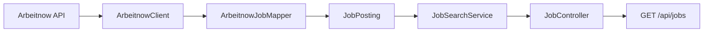

# JobRadar

An extensible job aggregation backend for data engineering and AI opportunities.


[](https://github.com/saveriobutright/JobRadar/actions/workflows/ci.yml)
[](LICENSE)

> JobRadar is under active development. The current version provides a tested end-to-end pipeline from an external job source to a local REST API.

## Features

- Fetches current job listings from the Arbeitnow public API.
- Converts provider-specific data into an immutable, source-neutral job model.
- Supports replaceable job providers through the `JobSource` interface.
- Aggregates results from every configured provider.
- Exposes job listings through a Spring MVC REST endpoint.
- Includes deterministic tests that do not depend on the live provider.

## Architecture



Provider-specific DTOs stay inside their integration package. The rest of the application works with the normalized `JobPosting` model and the common `JobSource` contract.

## Requirements

- Java 17 or later
- An Internet connection for live job retrieval

A global Maven installation is not required because the repository includes the Maven Wrapper.

## Quick Start

Clone the repository:

```bash
git clone https://github.com/saveriobutright/JobRadar.git
cd JobRadar
```

Run the application on Windows:

```powershell
.\mvnw.cmd spring-boot:run
```

Run the application on macOS or Linux:

```bash
./mvnw spring-boot:run
```

The API will be available at:

```text
http://localhost:8080
```

## API

### Get jobs

```http
GET /api/jobs
```

The optional `page` parameter selects the provider page:

```http
GET /api/jobs?page=2
```

If `page` is omitted, JobRadar requests page `1`.

Example with PowerShell:

```powershell
Invoke-RestMethod -Uri 'http://localhost:8080/api/jobs?page=1'
```

Example with curl:

```bash
curl "http://localhost:8080/api/jobs?page=1"
```

Example response:

```json
[
  {
    "source": "Arbeitnow",
    "sourceId": "data-engineer-example",
    "title": "Data Engineer",
    "company": "Example Company",
    "location": "Berlin",
    "remote": true,
    "sourceUrl": "https://www.arbeitnow.com/jobs/data-engineer-example",
    "postedAt": "2026-09-20T08:00:00Z"
  }
]
```

Each request currently retrieves fresh listings from the configured provider.

## Run the Tests

On Windows:

```powershell
.\mvnw.cmd test
```

On macOS or Linux:

```bash
./mvnw test
```

The test suite covers:

- provider JSON deserialization;
- normalization into `JobPosting`;
- mocked HTTP communication;
- aggregation across multiple sources;
- REST endpoint behavior;
- Spring application context startup.

## Project Structure

```text
src/main/java/io/github/saveriobutright/jobradar
├── jobs
│   ├── JobController.java
│   ├── JobPosting.java
│   └── JobSearchService.java
├── sources
│   ├── JobSource.java
│   └── arbeitnow
│       ├── ArbeitnowClient.java
│       ├── ArbeitnowJob.java
│       ├── ArbeitnowJobMapper.java
│       └── ArbeitnowPage.java
└── JobRadarApplication.java
```

## Data Source and Attribution

Job listings are currently provided by [Arbeitnow](https://www.arbeitnow.com/). JobRadar preserves the original listing URL so users can open the source posting directly.

Please use the public API responsibly and review the provider's terms before operating JobRadar at scale.

## Roadmap

- [x] Spring Boot REST API
- [x] Arbeitnow integration
- [x] Source-neutral job model
- [x] Offline HTTP and application tests
- [x] Continuous integration with GitHub Actions
- [ ] Persistent job storage and deduplication
- [ ] Scheduled ingestion pipeline
- [ ] Search and filtering
- [ ] Relevance scoring for data engineering and AI roles
- [ ] Web dashboard
- [ ] Docker support

## License

JobRadar is available under the [MIT License](LICENSE).