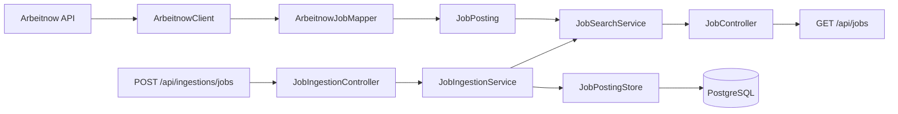

# JobRadar

An extensible job aggregation backend for data engineering and AI opportunities.


[](https://github.com/saveriobutright/JobRadar/actions/workflows/ci.yml)
[](LICENSE)

> JobRadar is under active development. It currently provides a tested pipeline from an external job source to normalized, transactionally persisted PostgreSQL data.

## Features

- Fetches current job listings from the Arbeitnow public API.
- Converts provider-specific data into an immutable, source-neutral job model.
- Supports replaceable job providers through the `JobSource` interface.
- Aggregates results from every configured provider.
- Persists normalized jobs in PostgreSQL.
- Prevents duplicate listings with atomic database upserts.
- Tracks when each listing was first and most recently observed.
- Manages schema changes through versioned Flyway migrations.
- Provides a reproducible PostgreSQL environment with Docker Compose.
- Exposes live listings and manual ingestion through Spring MVC REST endpoints.
- Uses Testcontainers to verify persistence against a real PostgreSQL instance.

## Architecture



Provider-specific DTOs remain inside their integration package. The rest of the application works with the normalized `JobPosting` model and the common `JobSource` contract.

`JobIngestionService` coordinates retrieval and persistence, while `JobPostingStore` owns the PostgreSQL-specific upsert. Flyway keeps the database schema reproducible and versioned.

## Requirements

- Java 17 or later
- Docker Desktop or Docker Engine with Docker Compose
- An Internet connection for live job retrieval

A global Maven installation is not required because the repository includes the Maven Wrapper. Docker must be running for the PostgreSQL development environment and persistence integration tests.

## Quick Start

Clone the repository:

```bash
git clone https://github.com/saveriobutright/JobRadar.git
cd JobRadar
```

Start PostgreSQL:

```bash
docker compose up -d
```

Confirm that the database is healthy:

```bash
docker compose ps
```

Run the application on Windows:

```powershell
.\mvnw.cmd spring-boot:run
```

Run the application on macOS or Linux:

```bash
./mvnw spring-boot:run
```

The API will be available at:

```text
http://localhost:8080
```

The Compose configuration provides these local development defaults:

```text
Database: jobradar
Username: jobradar
Password: jobradar
Port:     5432
```

These values can be overridden through `POSTGRES_DB`, `POSTGRES_USER`, and `POSTGRES_PASSWORD`. A local `.env` file is ignored by Git.

Stop the application with `Ctrl+C`. To stop PostgreSQL while preserving its data, run:

```bash
docker compose stop
```

## API

### Get live jobs

```http
GET /api/jobs
```

The optional `page` parameter selects the provider page:

```http
GET /api/jobs?page=2
```

If `page` is omitted, JobRadar requests page `1`.

Example with PowerShell:

```powershell
Invoke-RestMethod -Uri 'http://localhost:8080/api/jobs?page=1'
```

Example with curl:

```bash
curl "http://localhost:8080/api/jobs?page=1"
```

Example response:

```json
[
  {
    "source": "Arbeitnow",
    "sourceId": "data-engineer-example",
    "title": "Data Engineer",
    "company": "Example Company",
    "location": "Berlin",
    "remote": true,
    "sourceUrl": "https://www.arbeitnow.com/jobs/data-engineer-example",
    "postedAt": "2026-09-20T08:00:00Z"
  }
]
```

This endpoint retrieves fresh listings from the configured providers without persisting them.

### Ingest jobs

```http
POST /api/ingestions/jobs
```

The optional `page` parameter selects the provider page to retrieve and persist:

```http
POST /api/ingestions/jobs?page=1
```

Example with PowerShell:

```powershell
Invoke-RestMethod `
    -Method Post `
    -Uri 'http://localhost:8080/api/ingestions/jobs?page=1'
```

Example with curl:

```bash
curl -X POST "http://localhost:8080/api/ingestions/jobs?page=1"
```

Example response:

```json
{
  "page": 1,
  "processedJobs": 250
}
```

`processedJobs` includes both newly inserted listings and existing listings updated during the ingestion.

Repeated ingestion of the same provider page does not create duplicates. Existing records retain their original `first_seen_at` value and receive an updated `last_seen_at` value.

## Persistence Design

PostgreSQL identifies a listing through the combination of:

```text
source + source_id
```

The database enforces this identity with a composite unique constraint. JobRadar uses PostgreSQL `INSERT ... ON CONFLICT ... DO UPDATE` to insert new listings or refresh existing ones atomically.

A complete provider page is persisted inside one transaction. If any listing cannot be stored, the entire page is rolled back.

Flyway applies the schema from:

```text
src/main/resources/db/migration
```

## Run the Tests

Docker must be running because the persistence tests start an isolated PostgreSQL container.

On Windows:

```powershell
.\mvnw.cmd test
```

On macOS or Linux:

```bash
./mvnw test
```

The test suite covers:

- provider JSON deserialization;
- normalization into `JobPosting`;
- mocked HTTP communication;
- aggregation across multiple sources;
- REST endpoint behavior;
- ingestion workflow orchestration;
- PostgreSQL upsert and deduplication;
- transactional rollback;
- Flyway migration and Spring application context startup.

The tests do not modify the PostgreSQL database created by `compose.yml`. Testcontainers provides a separate disposable database on a random port.

## Project Structure

```text
.
├── compose.yml
├── pom.xml
└── src
    ├── main
    │   ├── java/io/github/saveriobutright/jobradar
    │   │   ├── jobs
    │   │   │   ├── persistence
    │   │   │   │   └── JobPostingStore.java
    │   │   │   ├── JobController.java
    │   │   │   ├── JobIngestionController.java
    │   │   │   ├── JobIngestionResult.java
    │   │   │   ├── JobIngestionService.java
    │   │   │   ├── JobPosting.java
    │   │   │   └── JobSearchService.java
    │   │   ├── sources
    │   │   │   ├── arbeitnow
    │   │   │   │   ├── ArbeitnowClient.java
    │   │   │   │   ├── ArbeitnowJob.java
    │   │   │   │   ├── ArbeitnowJobMapper.java
    │   │   │   │   └── ArbeitnowPage.java
    │   │   │   └── JobSource.java
    │   │   └── JobRadarApplication.java
    │   └── resources/db/migration
    │       └── V1__create_job_postings.sql
    └── test
        └── java/io/github/saveriobutright/jobradar
            └── TestcontainersConfiguration.java
```

## Data Source and Attribution

Job listings are currently provided by [Arbeitnow](https://www.arbeitnow.com/). JobRadar preserves the original listing URL so users can open the source posting directly.

Please use the public API responsibly and review the provider's terms before operating JobRadar at scale.

## Roadmap

- [x] Spring Boot REST API
- [x] Arbeitnow integration
- [x] Source-neutral job model
- [x] Continuous integration with GitHub Actions
- [x] Persistent PostgreSQL storage
- [x] Atomic deduplication and transactional ingestion
- [x] Manual ingestion endpoint
- [x] PostgreSQL integration tests with Testcontainers
- [x] Docker Compose development environment
- [ ] Scheduled ingestion pipeline
- [ ] Persistent search and filtering
- [ ] Relevance scoring for data engineering and AI roles
- [ ] Web dashboard
- [ ] Container image for the application

## License

JobRadar is available under the [MIT License](LICENSE).