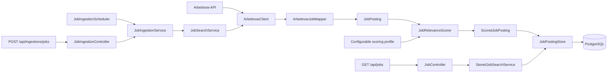

# JobRadar

An extensible job aggregation backend for data engineering and AI opportunities.


[](https://github.com/saveriobutright/JobRadar/actions/workflows/ci.yml)
[](LICENSE)

> JobRadar is under active development. It currently provides a tested pipeline from external job data to normalized PostgreSQL records with configurable, explainable relevance scoring.

## Features

- Fetches current job listings from the Arbeitnow public API.
- Converts provider-specific data into an immutable, source-neutral job model.
- Converts HTML descriptions into normalized plain text.
- Preserves provider tags and job types for search and scoring.
- Supports replaceable job providers through the `JobSource` interface.
- Persists normalized jobs in PostgreSQL.
- Prevents duplicate listings with atomic database upserts.
- Tracks when each listing was first seen, refreshed, and scored.
- Calculates deterministic relevance scores from 0 to 100.
- Explains every score through role, skill, job-type, and remote components.
- Uses a configurable profile for data engineering and AI opportunities.
- Orders stored jobs by publication date or relevance.
- Manages schema changes through versioned Flyway migrations.
- Provides a reproducible PostgreSQL environment with Docker Compose.
- Exposes manual ingestion and persisted search through Spring MVC REST endpoints.
- Supports opt-in scheduled ingestion with configurable page and delays.
- Filters stored jobs by title or company text, location, and remote status.
- Returns deterministic one-based pagination with total result metadata.
- Produces standard Problem Detail responses for invalid requests.
- Uses Testcontainers to verify persistence against a real PostgreSQL instance.

## Architecture



Provider-specific DTOs remain inside their integration package. The rest of the application works with the normalized `JobPosting` model and the common `JobSource` contract.

`ArbeitnowJobMapper` converts provider HTML into plain text and normalizes tags and job types before the data enters the application pipeline.

Manual requests and the opt-in scheduler both delegate to `JobIngestionService`. Each normalized job is evaluated by `JobRelevanceScorer` against the configured profile before `JobPostingStore` persists the listing and its score atomically.

`StoredJobSearchService` performs consistent read-only searches over PostgreSQL. `JobPostingStore` owns database-specific SQL, deterministic ordering, array conversion, filtering, and pagination. Flyway keeps the schema reproducible and versioned.

## Requirements

- Java 17 or later
- Docker Desktop or Docker Engine with Docker Compose
- An Internet connection for live job retrieval

A global Maven installation is not required because the repository includes the Maven Wrapper. Docker must be running for the PostgreSQL development environment and persistence integration tests.

## Quick Start

Clone the repository:

```bash
git clone https://github.com/saveriobutright/JobRadar.git
cd JobRadar
```

Start PostgreSQL:

```bash
docker compose up -d
```

Confirm that the database is healthy:

```bash
docker compose ps
```

Run the application on Windows:

```powershell
.\mvnw.cmd spring-boot:run
```

Run the application on macOS or Linux:

```bash
./mvnw spring-boot:run
```

The API will be available at:

```text
http://localhost:8080
```

The Compose configuration provides these local development defaults:

```text
Database: jobradar
Username: jobradar
Password: jobradar
Port:     5432
```

These values can be overridden through `POSTGRES_DB`, `POSTGRES_USER`, and `POSTGRES_PASSWORD`. A local `.env` file is ignored by Git.

Stop the application with `Ctrl+C`. To stop PostgreSQL while preserving its data, run:

```bash
docker compose stop
```

## API

### Search stored jobs

```http
GET /api/jobs
```

This endpoint searches jobs already persisted in PostgreSQL.

Supported query parameters:

| Parameter  |  Default | Description                                             |
|------------|---------:|---------------------------------------------------------|
| `page`     |      `1` | One-based page number                                   |
| `size`     |     `20` | Results per page, from 1 to 100                         |
| `query`    |        — | Case-insensitive text contained in the title or company |
| `location` |        — | Case-insensitive text contained in the location         |
| `remote`   |        — | `true` for remote jobs or `false` for onsite jobs       |
| `sort`     | `newest` | `newest` or `relevance`                                 |

Example:

```http
GET /api/jobs?page=1&size=5&query=data&sort=relevance
```

Example with PowerShell:

```powershell
Invoke-RestMethod `
    -Uri 'http://localhost:8080/api/jobs?page=1&size=5&query=data&sort=relevance'
```

Example with curl:

```bash
curl "http://localhost:8080/api/jobs?page=1&size=5&query=data&sort=relevance"
```

Example response:

```json
{
  "items": [
    {
      "id": 42,
      "source": "Arbeitnow",
      "sourceId": "data-engineer-example",
      "title": "Senior Data Engineer",
      "company": "Example Company",
      "description": "Build streaming platforms with Java and SQL.",
      "tags": [
        "Kafka",
        "Data"
      ],
      "jobTypes": [
        "Full-time"
      ],
      "location": "Berlin",
      "remote": true,
      "sourceUrl": "https://www.arbeitnow.com/jobs/data-engineer-example",
      "postedAt": "2026-09-20T08:00:00Z",
      "firstSeenAt": "2026-09-21T09:00:00Z",
      "lastSeenAt": "2026-09-23T09:00:00Z",
      "relevance": {
        "score": 90,
        "rolePoints": 45,
        "skillPoints": 30,
        "jobTypePoints": 10,
        "remotePoints": 5,
        "matchedRoles": [
          "data engineer"
        ],
        "matchedSkills": [
          "java",
          "sql",
          "kafka"
        ],
        "matchedJobTypes": [
          "full-time"
        ]
      },
      "scoredAt": "2026-09-23T09:00:00Z"
    }
  ],
  "page": 1,
  "size": 5,
  "totalItems": 26,
  "totalPages": 6
}
```

`sort=newest` orders results by `postedAt` from newest to oldest. `sort=relevance` orders results by descending relevance score. Both modes use stable database tie-breakers for deterministic pagination.

The database must contain ingested jobs before this endpoint can return results. Use the ingestion endpoint below to populate or refresh it.

Invalid pagination or sort values return an HTTP 400 Problem Detail response:

```json
{
  "detail": "page must be at least 1",
  "instance": "/api/jobs",
  "status": 400,
  "title": "Invalid request"
}
```

### Ingest jobs

```http
POST /api/ingestions/jobs
```

The optional `page` parameter selects the provider page to retrieve and persist:

```http
POST /api/ingestions/jobs?page=1
```

Example with PowerShell:

```powershell
Invoke-RestMethod `
    -Method Post `
    -Uri 'http://localhost:8080/api/ingestions/jobs?page=1'
```

Example with curl:

```bash
curl -X POST "http://localhost:8080/api/ingestions/jobs?page=1"
```

Example response:

```json
{
  "page": 1,
  "processedJobs": 250
}
```

`processedJobs` includes both newly inserted listings and existing listings updated during the ingestion.

Repeated ingestion of the same provider page does not create duplicates. Existing records retain their original `first_seen_at` value and receive an updated `last_seen_at` value.

## Relevance Scoring

Every normalized job is scored during ingestion before it is persisted. The algorithm is deterministic, requires no external AI service, and exposes the signals that produced the result.

| Component         | Maximum points | Rule                                                                           |
|-------------------|---------------:|--------------------------------------------------------------------------------|
| Target role       |             45 | At least one configured role appears in the job title                          |
| Skills            |             40 | Proportional to the configured skills found in the title, description, or tags |
| Job type          |             10 | At least one preferred job type matches                                        |
| Remote preference |              5 | The profile prefers remote work and the job is remote                          |

The final score is the sum of the four components and is always between 0 and 100.

Keyword matching is case-insensitive and uses token boundaries. For example, the skill `ai` does not accidentally match a word such as `maintain`.

The default profile targets data engineering and AI roles:

| Property                               | Environment variable                   | Default                                                                                                                 |
|----------------------------------------|----------------------------------------|-------------------------------------------------------------------------------------------------------------------------|
| `jobradar.scoring.target-roles`        | `JOBRADAR_SCORING_TARGET_ROLES`        | `Data Engineer, Analytics Engineer, Machine Learning Engineer, AI Engineer`                                             |
| `jobradar.scoring.skills`              | `JOBRADAR_SCORING_SKILLS`              | `SQL, Python, Java, Spring Boot, PostgreSQL, Docker, Apache Kafka, Apache Spark, Apache Airflow, AWS, Machine Learning` |
| `jobradar.scoring.preferred-job-types` | `JOBRADAR_SCORING_PREFERRED_JOB_TYPES` | `Full-time`                                                                                                             |
| `jobradar.scoring.remote-preferred`    | `JOBRADAR_SCORING_REMOTE_PREFERRED`    | `true`                                                                                                                  |

Comma-separated environment variables can override the list properties without changing the repository.

Example on Windows PowerShell:

```powershell
$env:JOBRADAR_SCORING_TARGET_ROLES='Data Engineer,AI Engineer'
$env:JOBRADAR_SCORING_SKILLS='SQL,Python,Java,Kafka'
.\mvnw.cmd spring-boot:run
```

Example on macOS or Linux:

```bash
JOBRADAR_SCORING_TARGET_ROLES='Data Engineer,AI Engineer' \
JOBRADAR_SCORING_SKILLS='SQL,Python,Java,Kafka' \
    ./mvnw spring-boot:run
```

Scores are persisted snapshots of the profile used during ingestion. After changing the profile, ingest the relevant provider pages again to refresh their scores.

## Scheduled Ingestion

Automatic ingestion is disabled by default. This prevents a freshly cloned application from sending unexpected requests to the public provider API.

The scheduler uses the same transactional ingestion service as the manual endpoint. It waits for each run to finish before starting the fixed-delay timer, preventing overlapping executions within one application instance.

| Property                                    | Environment variable                        | Default | Description                                       |
|---------------------------------------------|---------------------------------------------|---------|---------------------------------------------------|
| `jobradar.ingestion.schedule.enabled`       | `JOBRADAR_INGESTION_SCHEDULE_ENABLED`       | `false` | Enables automatic ingestion                       |
| `jobradar.ingestion.schedule.page`          | `JOBRADAR_INGESTION_SCHEDULE_PAGE`          | `1`     | Provider page ingested on each run                |
| `jobradar.ingestion.schedule.fixed-delay`   | `JOBRADAR_INGESTION_SCHEDULE_FIXED_DELAY`   | `PT1H`  | Delay measured after the previous run completes   |
| `jobradar.ingestion.schedule.initial-delay` | `JOBRADAR_INGESTION_SCHEDULE_INITIAL_DELAY` | `PT30S` | Delay before the first run after application boot |

Durations use the ISO 8601 format. For example, `PT30S` means 30 seconds and `PT1H` means one hour.

Enable the scheduler on Windows PowerShell:

```powershell
$env:JOBRADAR_INGESTION_SCHEDULE_ENABLED='true'
.\mvnw.cmd spring-boot:run
```

Enable it on macOS or Linux:

```bash
JOBRADAR_SCORING_TARGET_ROLES='Data Engineer,AI Engineer' \
JOBRADAR_SCORING_SKILLS='SQL,Python,Java,Kafka' \
    ./mvnw spring-boot:run
```

Each successful run logs the configured page and the number of processed jobs. Existing listings are updated through the same atomic upsert used by manual ingestion.

Each application instance owns its scheduler. Deployments with multiple replicas should coordinate ingestion externally or add distributed locking to ensure that only one replica contacts the provider.

## Persistence Design

PostgreSQL identifies a listing through the combination of:

```text
source + source_id
```

The database enforces this identity with a composite unique constraint. JobRadar uses PostgreSQL `INSERT ... ON CONFLICT ... DO UPDATE` to insert new listings or refresh existing ones atomically.

Normalized descriptions are stored as plain text. Provider tags, job types, and matched scoring signals use PostgreSQL `TEXT[]` columns.

The database stores both the total relevance score and its individual components. Check constraints guarantee a range from 0 to 100 and require the total to equal the sum of its components. A descending relevance index supports efficient ranked searches.

A complete provider page is persisted inside one transaction. If any listing cannot be stored, the entire page is rolled back.

Flyway applies the schema from:

```text
src/main/resources/db/migration
```

## Run the Tests

Docker must be running because the persistence tests start an isolated PostgreSQL container.

On Windows:

```powershell
.\mvnw.cmd test
```

On macOS or Linux:

```bash
./mvnw test
```

The test suite covers:

- provider JSON deserialization;
- HTML description and metadata normalization;
- source-neutral job mapping;
- mocked HTTP communication;
- aggregation across multiple sources;
- deterministic relevance scoring and keyword boundaries;
- configurable profile binding;
- ingestion scoring and persistence orchestration;
- scheduled ingestion delegation, conditional activation, and configuration validation;
- PostgreSQL upsert and deduplication;
- transactional rollback;
- enriched content and explainable score persistence;
- newest-first and relevance-first ordering;
- stored filtering, pagination, and row mapping;
- pagination metadata calculation;
- REST success and Problem Detail error responses;
- Flyway migrations and Spring application context startup.

The tests do not modify the PostgreSQL database created by `compose.yml`. Testcontainers provides a separate disposable database on a random port.

## Project Structure

```text
.
├── compose.yml
├── pom.xml
└── src
    ├── main
    │   ├── java/io/github/saveriobutright/jobradar
    │   │   ├── api
    │   │   │   └── ApiExceptionHandler.java
    │   │   ├── jobs
    │   │   │   ├── persistence
    │   │   │   │   └── JobPostingStore.java
    │   │   │   ├── scheduling
    │   │   │   │   ├── JobIngestionScheduleProperties.java
    │   │   │   │   ├── JobIngestionScheduler.java
    │   │   │   │   └── JobSchedulingConfiguration.java
    │   │   │   ├── scoring
    │   │   │   │   ├── JobRelevanceProfile.java
    │   │   │   │   ├── JobRelevanceScore.java
    │   │   │   │   ├── JobRelevanceScorer.java
    │   │   │   │   ├── JobScoringConfiguration.java
    │   │   │   │   ├── JobScoringProperties.java
    │   │   │   │   └── ScoredJobPosting.java
    │   │   │   ├── InvalidSearchCriteriaException.java
    │   │   │   ├── JobController.java
    │   │   │   ├── JobIngestionController.java
    │   │   │   ├── JobIngestionResult.java
    │   │   │   ├── JobIngestionService.java
    │   │   │   ├── JobPosting.java
    │   │   │   ├── JobSearchCriteria.java
    │   │   │   ├── JobSearchResult.java
    │   │   │   ├── JobSearchService.java
    │   │   │   ├── JobSort.java
    │   │   │   ├── StoredJobPosting.java
    │   │   │   └── StoredJobSearchService.java
    │   │   ├── sources
    │   │   │   ├── arbeitnow
    │   │   │   │   ├── ArbeitnowClient.java
    │   │   │   │   ├── ArbeitnowJob.java
    │   │   │   │   ├── ArbeitnowJobMapper.java
    │   │   │   │   └── ArbeitnowPage.java
    │   │   │   └── JobSource.java
    │   │   └── JobRadarApplication.java
    │   └── resources
    │       ├── application.properties
    │       └── db/migration
    │           ├── V1__create_job_postings.sql
    │           ├── V2__add_job_content.sql
    │           └── V3__add_job_relevance.sql
    └── test
        └── java/io/github/saveriobutright/jobradar
            └── TestcontainersConfiguration.java
```

## Data Source and Attribution

Job listings are currently provided by [Arbeitnow](https://www.arbeitnow.com/). JobRadar preserves the original listing URL so users can open the source posting directly.

Please use the public API responsibly and review the provider's terms before operating JobRadar at scale.

## Roadmap

- [x] Spring Boot REST API
- [x] Arbeitnow integration
- [x] Source-neutral job model
- [x] Continuous integration with GitHub Actions
- [x] Persistent PostgreSQL storage
- [x] Atomic deduplication and transactional ingestion
- [x] Manual ingestion endpoint
- [x] PostgreSQL integration tests with Testcontainers
- [x] Docker Compose development environment
- [x] Configurable scheduled ingestion pipeline
- [x] Persistent search, filtering, and pagination
- [x] Explainable relevance scoring for data engineering and AI roles
- [ ] Web dashboard
- [ ] Container image for the application

## License

JobRadar is available under the [MIT License](LICENSE).

## Author

**Saverio Polito**

- [GitHub](https://github.com/saveriobutright)
- [LinkedIn](https://www.linkedin.com/in/saverio-polito-a407a53ba)
